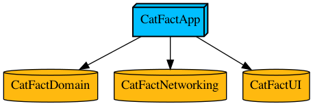

# CatFacts
Clean Modular Domain Driven Architecture Example

# Contents
## CatFactsDomain
Contains separated Business Logic of the Cat Facts domain.
Modeled with a strong type system and pure functions.
Must not have any dependencies except Foundation to keep its cleanness.

## CatFactsNetworkService
A microservice for working with https://catfact.ninja/fact API.

## CatFactsUI
Framework with UI layer.

## CatFactsApp
A root node of a modular tree, combining other modules and passing inputs and outputs between them.

# Graph

