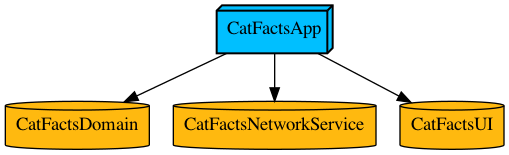

# CatFacts
An example of an app architecture with concepts:
- Modular 
- Unidirectional 
- Domain Driven 
- with Data-Driven UI
- automated by Tuist

# Contents
## Tuist
- Module.swift contains an enum with declarative desciption of all modules and their dependencies.

## CatFactsDomain
- Contains separated Business Logic of the Cat Facts domain.
- Modeled with a strong type system and pure functions.
- Must not have any dependencies except Foundation to keep its cleanness.

## CatFactsNetworkService
- A microservice working with https://catfact.ninja/fact API.

## CatFactsUI
- Framework with UI layer.

## CatFactsApp
- A root node of a modular tree, combining other modules and passing inputs and outputs between them.

# Graph
- Generated by $ tuist graph --skip-test-targets

# Bootstrap
- This is a Tuist-driven App, so read https://docs.tuist.io/ first.
- To generate .xcproject and .xcrowkspace files use $ tuist generate
